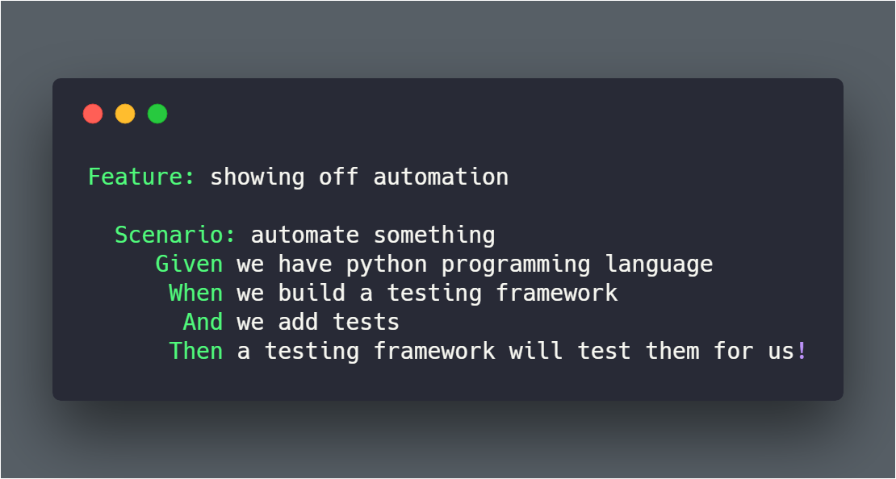

# Automaton project

This project was developed to show how possible to automate similar scenarios on different programming languages and a variety of testing frameworks.
I've tried to cover popular testing approaches such as UI testing, API testing, and Performance/Load testing.

  

## List of repositories:

1) [Automaton-v1](https://github.com/BurhanH/automaton-v1 "Automaton-v1 project") UI validation, Python, Selenium, Behave  
2) [Automaton-v2](https://github.com/BurhanH/automaton-v2 "Automaton-v2 project") UI validation, Python, Selenium, Unittest  
3) [Automaton-v3](https://github.com/BurhanH/automaton-v3 "Automaton-v3 project") UI validation, Python, Selenium, Pytest  
4) [Automaton-v4](https://github.com/BurhanH/automaton-v4 "Automaton-v4 project") UI validation, Ruby, Selenium, Cucumber  
5) [Automaton-v5](https://github.com/BurhanH/automaton-v5 "Automaton-v5 project") API validation, Python, Unittest  
6) [Automaton-v6](https://github.com/BurhanH/automaton-v6 "Automaton-v6 project") API validation, Python, Pytest  
7) [Automaton-v7](https://github.com/BurhanH/automaton-v7 "Automaton-v7 project") UI validation, JavaScript, Selenium, Mocha  
8) [Automaton-v8](https://github.com/BurhanH/automaton-v8 "Automaton-v8 project") UI validation, Java, Selenium, JUnit  
9) [Automaton-v9](https://github.com/BurhanH/automaton-v9 "Automaton-v9 project") UI | Visual validation, Python, Selenium, Unittest  
10) [Automaton-v10](https://github.com/BurhanH/automaton-v10 "Automaton-v10 project") Performance | Load validation, Scala, Gatling tool  
11) [Automaton-v11](https://github.com/BurhanH/automaton-v11 "Automaton-v11 project") UI validation, Java, Selenium, TestNG  
12) [Automaton-v12](https://github.com/BurhanH/automaton-v12 "Automaton-v12 project") UI validation, Java, Selenium, TestNG, PageFactory  
13) [Automaton-v13](https://github.com/BurhanH/automaton-v13 "Automaton-v13 project") Java, Junit, Cucumber  
14) [Automaton-v14](https://github.com/BurhanH/automaton-v14 "Automaton-v14 project") UI validation, Java, Junit, Cucumber, Selenium, PageFactory  
15) [Automaton-v15](https://github.com/BurhanH/automaton-v15 "Automaton-v15 project") API validation, JavaScript, Mocha, Chai, Supertest  
16) [Automaton-v16](https://github.com/BurhanH/automaton-v16 "Automaton-v16 project") Test Infrastructure, Travis CI, Docker, Selenium Grid  
17) [Automaton-v17](https://github.com/BurhanH/automaton-v17 "Automaton-v17 project") Chatbot validation, Python, Unittest  
18) [Automaton-v18](https://github.com/BurhanH/automaton-v18 "Automaton-v18 project") Robot framework, Python (Under construction)    
19) [Automaton-v19](https://github.com/BurhanH/automaton-v19 "Automaton-v19 project") Appium, Android, NodeJS, Python (Deprecated)  
20) [Automaton-v20](https://github.com/BurhanH/Automaton-v20 "Automaton-v20 project") API validation, Java, REST assured, JUnit  
21) [Automaton-v21](https://github.com/BurhanH/Automaton-v21 "Automaton-v21 project") UI + REST API validation, Cypress, Mocha  
22) [Automaton-v22](https://github.com/BurhanH/Automaton-v22 "Automaton-v22 project") Performance | Load testing, Python, Locust  
23) [Automaton-v23](https://github.com/BurhanH/automaton-v23 "Automaton-v23 project") API validation, C#, .Net8, MSTest, Refit  
24) [Automaton-v24](https://github.com/BurhanH/automaton-v24 "Automaton-v24 project") API validation, C#, .Net8, MSTest ,RestSharp  
25) [Automaton-v25](https://github.com/BurhanH/automaton-v25 "Automaton-v25 project") API validation, C#, .Net8, TUnit, Refit  
26) [Automaton-v26](https://github.com/BurhanH/automaton-v26 "Automaton-v26 project") API validation, C#, .Net8, XUnit, Refit  
27) [Automaton-v27](https://github.com/BurhanH/automaton-v27 "Automaton-v27 project") API validation, C#, .Net8, XUnit, MSTest, Refit  
28) [Automaton-v28](https://github.com/BurhanH/automaton-v28 "Automaton-v28 project") UI validation, C#, .Net8, MSTest, Playwright  
29) [Automaton-v29](https://github.com/BurhanH/automaton-v29 "Automaton-v29 project") UI validation, C#, .Net8, MSTest, NUnit, Selenium  
